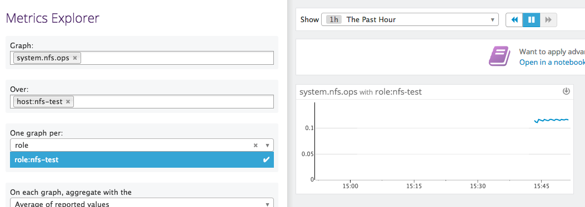

# datadog-nfs-vagrant
This will create an Ubuntu vagrant with an nfs synced directory (see
https://www.vagrantup.com/docs/synced-folders/nfs.html).

## Running
- Execute `DD_API_KEY=$DD_API_KEY vagrant up` from the command line, where
  `$DD_API_KEY` is either an environment variable or your actual API key.
- You can ssh into the box via `vagrant ssh`
- You can verify the Datadog agent is running and nfs reporting via:
  `sudo /etc/init.d/datadog-agent info`
  - Part of the output should report:
    ```
      nfsstat (5.18.0)
      ----------------
        - instance #0 [OK]
        - Collected 16 metrics, 0 events & 0 service checks
    ```

## Verifying
In the [Datadog Metrics explorer](https://app.datadoghq.com/metric/explorer)
you'll be able to find these metrics under the `system.nfs.*` namespace. If you
haven't modified the Vagrantfile in this repo you can find them under the
`host:nfs-test` host or the tag `role:nfs-test` as seen below:


